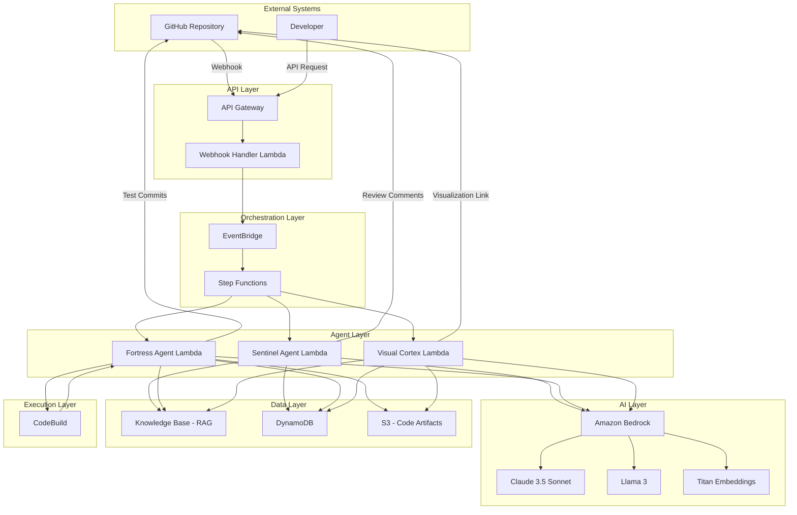
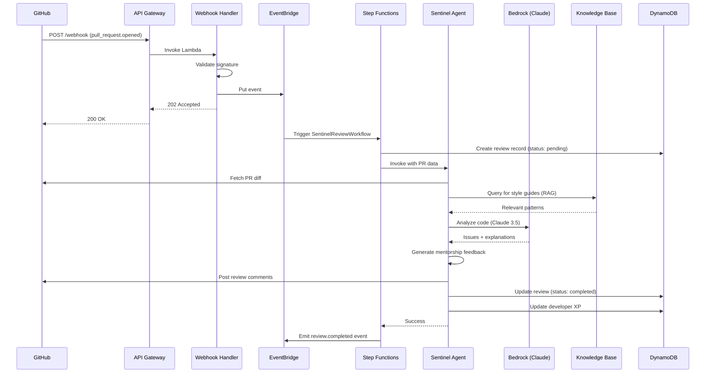
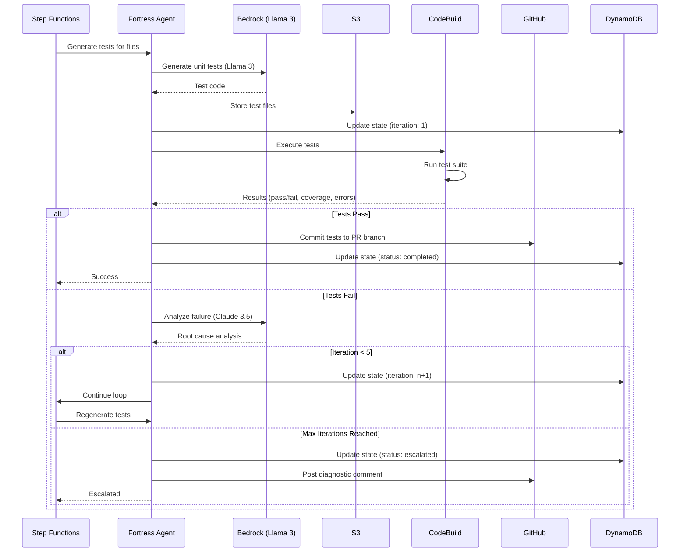
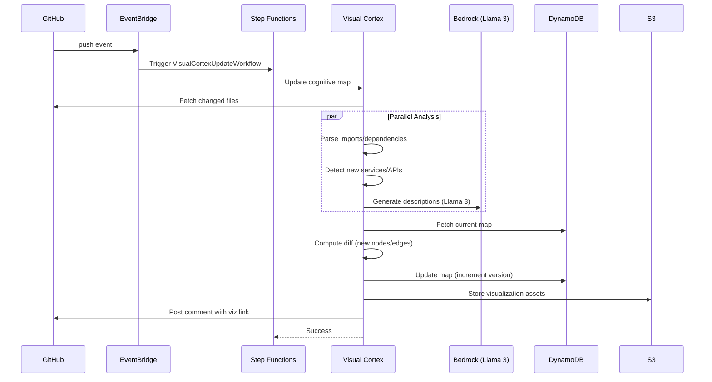

# Design Document: Velocis

## Overview

Velocis implements an autonomous, event-driven architecture using AWS serverless services to create a "Digital Team Member" that operates with agency rather than as a passive assistant. The system consists of three specialized agents (Sentinel, Fortress, Visual Cortex) orchestrated through AWS Step Functions, with Amazon Bedrock providing multi-model AI capabilities through intelligent routing.

The architecture prioritizes zero idle costs, sub-3-second response times, and autonomous operation without human intervention. Each agent operates independently but shares context through a centralized Knowledge Base and metadata store, enabling coordinated behavior across the codebase lifecycle.

## Architecture

### High-Level System Architecture



### Component Responsibilities

**API Gateway + Webhook Handler**
- Receives GitHub webhook events (pull_request, push, etc.)
- Validates webhook signatures for security
- Routes events to EventBridge for async processing
- Provides REST API for developer queries (XP, visualization access)

**EventBridge**
- Decouples webhook ingestion from processing
- Routes events to appropriate Step Functions workflows
- Enables event replay for failure recovery

**Step Functions Orchestrator**
- Manages Sentinel review workflow (linear)
- Manages Fortress self-healing loop (iterative with conditional branching)
- Manages Visual Cortex update workflow (parallel processing)
- Handles retries and error escalation

**Sentinel Agent**
- Analyzes pull request diffs using Claude 3.5 Sonnet
- Queries Knowledge Base for project-specific patterns
- Detects security vulnerabilities (SQL injection, XSS, credential leaks)
- Generates mentorship-style feedback with explanations
- Posts review comments to GitHub
- Updates XP scores in DynamoDB

**Fortress Agent**
- Generates unit/integration tests using Llama 3
- Executes tests via CodeBuild
- Analyzes test failures and regenerates tests
- Implements self-healing loop (max 5 iterations)
- Commits passing tests to repository
- Stores test artifacts in S3

**Visual Cortex Agent**
- Parses codebase to extract architecture (services, APIs, dependencies)
- Generates ReactFlow graph data structure
- Updates graph on code changes
- Provides real-time animation data for active processing
- Serves interactive visualization via API Gateway

**Amazon Bedrock**
- Provides unified interface to multiple models
- Routes complex reasoning to Claude 3.5 Sonnet
- Routes high-speed generation to Llama 3
- Generates embeddings via Titan for RAG

**Knowledge Base (RAG)**
- Stores project-specific style guides, architecture patterns
- Indexed using Titan embeddings
- Queried by agents for context-aware analysis
- Updated when documentation changes

**DynamoDB**
- Stores repository metadata (language, framework, config)
- Stores XP scores and gamification data
- Stores workflow state for Step Functions
- Stores Cognitive Map graph structure

**S3**
- Stores generated test files before commit
- Stores code analysis artifacts
- Stores visualization assets

**CodeBuild**
- Executes generated tests in isolated environment
- Returns test results (pass/fail, coverage, errors)
- Supports multiple language runtimes (Node.js, Python, Java)

## Data Models

### Repository Metadata

```typescript
interface Repository {
  repositoryId: string;           // PK: GitHub repo ID
  owner: string;                  // GitHub org/user
  name: string;                   // Repository name
  primaryLanguage: string;        // Detected language (JavaScript, Python, etc.)
  testFramework: string;          // Jest, Pytest, JUnit
  knowledgeBaseId: string;        // Associated KB ID
  webhookSecret: string;          // Encrypted webhook secret
  createdAt: string;              // ISO timestamp
  lastAnalyzedAt: string;         // ISO timestamp
  configOverrides: {
    minCoverage: number;          // Minimum test coverage %
    maxSelfHealIterations: number; // Fortress loop limit
    enableMentorshipMode: boolean;
  };
}
```

### Pull Request Review

```typescript
interface PullRequestReview {
  reviewId: string;               // PK: UUID
  repositoryId: string;           // GSI: Repository lookup
  pullRequestNumber: number;      // GitHub PR number
  status: 'pending' | 'in_progress' | 'completed' | 'failed';
  triggeredAt: string;            // ISO timestamp
  completedAt?: string;           // ISO timestamp
  sentinelResult: {
    approved: boolean;
    issuesFound: Issue[];
    securityScore: number;        // 0-100
    codeQualityScore: number;     // 0-100
    feedbackPosted: boolean;
  };
  fortressResult: {
    testsGenerated: number;
    testsPassing: number;
    coveragePercent: number;
    selfHealIterations: number;
    committed: boolean;
  };
  xpAwarded: number;
}

interface Issue {
  severity: 'critical' | 'high' | 'medium' | 'low';
  type: 'security' | 'logic' | 'style' | 'performance';
  file: string;
  line: number;
  message: string;
  explanation: string;            // Mentorship mode content
  codeExample?: string;           // Before/after example
}
```

### Developer XP Tracking

```typescript
interface DeveloperXP {
  developerId: string;            // PK: GitHub user ID
  username: string;               // GitHub username
  totalXP: number;
  level: number;                  // Calculated from totalXP
  repositories: string[];         // List of repo IDs
  history: XPEvent[];
  badges: Badge[];
}

interface XPEvent {
  timestamp: string;              // ISO timestamp
  xpChange: number;               // Can be negative
  reason: string;                 // "clean_pr", "fixed_security", etc.
  repositoryId: string;
  pullRequestNumber: number;
}

interface Badge {
  badgeId: string;
  name: string;                   // "Security Champion", "Test Master"
  earnedAt: string;               // ISO timestamp
}
```

### Cognitive Map Structure

```typescript
interface CognitiveMap {
  repositoryId: string;           // PK
  version: number;                // Incremented on updates
  lastUpdated: string;            // ISO timestamp
  nodes: ArchitectureNode[];
  edges: ArchitectureEdge[];
}

interface ArchitectureNode {
  nodeId: string;                 // Unique identifier
  type: 'service' | 'api' | 'database' | 'external' | 'function';
  label: string;                  // Display name
  files: string[];                // Associated file paths
  metadata: {
    language?: string;
    framework?: string;
    linesOfCode?: number;
  };
  position: {
    x: number;
    y: number;
  };
  isActive: boolean;              // Currently being processed
}

interface ArchitectureEdge {
  edgeId: string;
  source: string;                 // nodeId
  target: string;                 // nodeId
  type: 'api_call' | 'data_flow' | 'dependency';
  label?: string;                 // HTTP method, data type, etc.
}
```

### Test Generation State

```typescript
interface TestGenerationState {
  stateId: string;                // PK: UUID
  repositoryId: string;
  pullRequestNumber: number;
  targetFiles: string[];          // Files needing tests
  iteration: number;              // Current self-heal iteration
  status: 'generating' | 'executing' | 'analyzing' | 'completed' | 'escalated';
  generatedTests: GeneratedTest[];
  errors: TestError[];
}

interface GeneratedTest {
  testFile: string;               // Path to test file
  targetFile: string;             // File being tested
  framework: string;              // Jest, Pytest, etc.
  content: string;                // Test code
  s3Key: string;                  // S3 location
  executionResult?: {
    passed: boolean;
    coverage: number;
    failureReason?: string;
    stackTrace?: string;
  };
}

interface TestError {
  iteration: number;
  testFile: string;
  errorMessage: string;
  stackTrace: string;
  analysisResult: string;         // AI analysis of error
}
```

## Component Interactions

### Sentinel Agent Workflow



### Fortress Self-Healing Loop



### Visual Cortex Update Flow



## Correctness Properties

*A property is a characteristic or behavior that should hold true across all valid executions of a system—essentially, a formal statement about what the system should do. Properties serve as the bridge between human-readable specifications and machine-verifiable correctness guarantees.*

### Webhook and Event Processing Properties

Property 1: Webhook trigger responsiveness
*For any* Pull Request opened in a monitored repository, the Sentinel Agent should trigger automatically within 30 seconds of the webhook event.
**Validates: Requirements 1.1**

Property 2: Asynchronous webhook processing
*For any* GitHub webhook event received, the system should process it asynchronously to prevent GitHub webhook timeouts.
**Validates: Requirements 7.5**

### Security Analysis Properties

Property 3: Security vulnerability detection
*For any* code containing known security vulnerabilities (SQL injection, XSS, credential leaks), the Sentinel Agent should detect and flag them.
**Validates: Requirements 1.3**

Property 4: Severity classification completeness
*For any* detected security vulnerability, the Sentinel Agent should assign a severity level (Critical, High, Medium, Low).
**Validates: Requirements 1.4**

Property 5: Credential leak blocking
*For any* code containing detected credential leaks, the system should flag them as Critical severity and block merge.
**Validates: Requirements 10.7**

Property 6: Credential redaction in storage
*For any* code snippet stored for analysis, the system should redact detected API keys, passwords, and credentials.
**Validates: Requirements 10.4**

### Knowledge Base and Context Properties

Property 7: Knowledge Base query execution
*For any* code analysis performed by Sentinel Agent, a query should be made to the Knowledge Base using RAG with Titan embeddings.
**Validates: Requirements 2.1**

Property 8: Style guide reference
*For any* code comparison against standards, the Sentinel Agent should reference project-specific style guides from the Knowledge Base.
**Validates: Requirements 2.2**

Property 9: Architecture pattern matching
*For any* architecture evaluation, the Sentinel Agent should compare against established patterns in the Knowledge Base.
**Validates: Requirements 2.3**

### Mentorship and Feedback Properties

Property 10: Comprehensive mentorship feedback
*For any* feedback provided on code issues, the Sentinel Agent should include: (1) explanation of underlying concepts for logic errors, (2) attack vector explanation for security issues, (3) before-and-after code examples for improvements, and (4) authoritative source references for best practices.
**Validates: Requirements 11.1, 11.2, 11.3, 11.4**

Property 11: Feedback prioritization
*For any* pull request with multiple issues, the Sentinel Agent should prioritize feedback by severity and learning value.
**Validates: Requirements 11.6**

Property 12: Line-specific review comments
*For any* pull request reviewed, the Sentinel Agent should post feedback as GitHub review comments on specific code lines.
**Validates: Requirements 15.1**

### Test Generation Properties

Property 13: Automatic test generation trigger
*For any* new code committed without tests, the Fortress Agent should automatically generate unit tests.
**Validates: Requirements 3.1**

Property 14: Framework-appropriate test generation
*For any* test generation, the Fortress Agent should create tests in the framework matching the code language (Jest for JavaScript/TypeScript, Pytest for Python).
**Validates: Requirements 3.2**

Property 15: Minimum coverage achievement
*For any* generated test suite, the Fortress Agent should achieve minimum 80% code coverage for the modified code.
**Validates: Requirements 3.3**

Property 16: Edge case test inclusion
*For any* generated test suite, the Fortress Agent should include test cases for edge conditions and error handling.
**Validates: Requirements 3.4**

Property 17: Testing convention adherence
*For any* generated tests, the Fortress Agent should follow project-specific testing conventions from the Knowledge Base.
**Validates: Requirements 3.5**

### Self-Healing Loop Properties

Property 18: Self-healing loop initiation
*For any* generated test that fails execution, the Fortress Agent should automatically initiate the Self-Healing Loop.
**Validates: Requirements 4.1**

Property 19: Failure analysis execution
*For any* Self-Healing Loop iteration, the Fortress Agent should analyze the failure reason using error logs and stack traces.
**Validates: Requirements 4.2**

Property 20: Failure source classification
*For any* test failure analysis, the Fortress Agent should identify whether the issue is in the test code or implementation code.
**Validates: Requirements 4.3**

Property 21: Test code regeneration
*For any* failure identified as test code issue, the Fortress Agent should regenerate the test with corrections.
**Validates: Requirements 4.4**

Property 22: Implementation issue reporting
*For any* failure identified as implementation code issue, the Fortress Agent should report the issue to the developer with suggested fixes.
**Validates: Requirements 4.5**

Property 23: Test re-execution after regeneration
*For any* test regeneration, the Fortress Agent should re-execute the tests using AWS CodeBuild.
**Validates: Requirements 4.6**

Property 24: Passing test commitment
*For any* test suite that passes all tests, the Fortress Agent should commit it to the repository.
**Validates: Requirements 4.8**

Property 25: Test commit to PR branch
*For any* test generation completion, the Fortress Agent should create a new commit in the Pull Request branch with the test files.
**Validates: Requirements 15.2**

### Cognitive Map Properties

Property 26: Initial map generation timing
*For any* repository connected to Velocis, the Visual Cortex Agent should generate an initial Cognitive Map within 10 minutes.
**Validates: Requirements 5.1**

Property 27: Component type identification
*For any* Cognitive Map generation, the Visual Cortex Agent should identify all services, APIs, databases, and external dependencies.
**Validates: Requirements 5.2**

Property 28: Map update responsiveness
*For any* code change committed, the Visual Cortex Agent should update the Cognitive Map to reflect new dependencies within 2 minutes.
**Validates: Requirements 5.4**

Property 29: Node interaction data display
*For any* Architecture Node clicked by a developer, the Visual Cortex Agent should display associated code files, dependencies, and recent changes.
**Validates: Requirements 5.6**

Property 30: Directional dependency visualization
*For any* dependency display in the Cognitive Map, the Visual Cortex Agent should show directional arrows indicating data flow and API call patterns.
**Validates: Requirements 5.7**

Property 31: Map update notification
*For any* Cognitive Map update, the Visual Cortex Agent should post a summary comment with a link to the interactive visualization.
**Validates: Requirements 15.5**

### Model Routing Properties

Property 32: Complex reasoning model routing
*For any* task requiring complex reasoning (security analysis, logic review), the system should route the request to Claude 3.5 Sonnet via Amazon Bedrock.
**Validates: Requirements 6.1**

Property 33: High-speed generation model routing
*For any* task requiring high-speed text generation (documentation, boilerplate, basic tests), the system should route the request to Llama 3 via Amazon Bedrock.
**Validates: Requirements 6.2**

Property 34: Embedding model consistency
*For any* embedding generation for RAG, the system should use Amazon Titan embedding models.
**Validates: Requirements 6.3**

Property 35: Routing decision latency
*For any* model routing decision, the system should complete the decision within 100 milliseconds.
**Validates: Requirements 6.4**

Property 36: Model failure retry
*For any* model request failure, the system should retry with an alternative model and log the failure.
**Validates: Requirements 6.5**

### XP and Gamification Properties

Property 37: Comprehensive XP calculation and storage
*For any* developer action (PR submission, clean code review, issue fix), the system should: (1) calculate XP based on code quality metrics (coverage, security score, style adherence), (2) award appropriate XP (base XP for submission, bonus for clean code, learning XP for fixes), and (3) store the updated score in DynamoDB.
**Validates: Requirements 8.1, 8.2, 8.3, 8.4, 8.6**

Property 38: Progress data completeness
*For any* developer progress request, the system should display XP history, improvement trends, and skill badges.
**Validates: Requirements 8.5**

### Repository Onboarding Properties

Property 39: Webhook validation timing
*For any* repository connection, the system should validate GitHub webhook configuration within 30 seconds.
**Validates: Requirements 9.1**

Property 40: Language detection execution
*For any* repository onboarding, the system should analyze the codebase to detect the primary programming language.
**Validates: Requirements 9.2**

Property 41: Framework auto-configuration
*For any* programming language detection, the system should configure appropriate testing frameworks automatically.
**Validates: Requirements 9.3**

Property 42: Initial Knowledge Base generation
*For any* completed onboarding, the system should generate an initial Knowledge Base by indexing existing documentation and code patterns.
**Validates: Requirements 9.4**

Property 43: Onboarding failure messaging
*For any* onboarding failure, the system should provide clear error messages with remediation steps.
**Validates: Requirements 9.5**

### Security and Access Control Properties

Property 44: OAuth permission minimization
*For any* GitHub repository access, the system should use OAuth tokens with minimum required permissions (read code, write comments).
**Validates: Requirements 10.3**

Property 45: Code content ephemeral storage
*For any* Pull Request processing, the system should not store full code content beyond the analysis session.
**Validates: Requirements 10.5**

### Performance Properties

Property 46: Small PR review timing
*For any* Pull Request under 500 lines, the Sentinel Agent should complete the review within 2 minutes.
**Validates: Requirements 12.2**

Property 47: Small file test generation timing
*For any* file under 300 lines, the Fortress Agent should complete test generation within 90 seconds.
**Validates: Requirements 12.3**

Property 48: Small repository map update timing
*For any* repository under 100,000 lines, the Visual Cortex Agent should process codebase changes within 2 minutes.
**Validates: Requirements 12.4**

Property 49: DynamoDB query latency
*For any* DynamoDB metadata query, the system should retrieve results within 100 milliseconds.
**Validates: Requirements 12.6**

Property 50: Lambda cold start timing
*For any* Lambda function cold start, the system should complete initialization within 3 seconds.
**Validates: Requirements 7.4**

### Error Handling and Resilience Properties

Property 51: Bedrock API retry logic
*For any* Bedrock API call failure, the system should retry up to 3 times with exponential backoff.
**Validates: Requirements 13.1**

Property 52: Retry exhaustion handling
*For any* exhausted retry attempts, the system should log the error and notify the developer with a fallback message.
**Validates: Requirements 13.2**

Property 53: Webhook failure fallback
*For any* GitHub webhook delivery failure, the system should implement a polling fallback mechanism checking every 5 minutes.
**Validates: Requirements 13.3**

Property 54: Lambda timeout resumption
*For any* Lambda function timeout, the system should capture partial results and resume processing in a new invocation.
**Validates: Requirements 13.5**

Property 55: DynamoDB throttling backoff
*For any* DynamoDB throttling event, the system should implement exponential backoff and queue requests.
**Validates: Requirements 13.6**

### Documentation Generation Properties

Property 56: Inline documentation generation
*For any* new function or class added, the system should generate inline documentation comments using Llama 3.
**Validates: Requirements 14.1**

Property 57: API documentation updates
*For any* API endpoint modification, the system should update API documentation automatically.
**Validates: Requirements 14.2**

Property 58: Language-specific documentation conventions
*For any* documentation generation, the system should follow language-specific conventions (JSDoc for JavaScript, docstrings for Python).
**Validates: Requirements 14.3**

Property 59: Documentation component completeness
*For any* generated documentation, the system should include parameter descriptions, return types, and usage examples.
**Validates: Requirements 14.4**

Property 60: Complex logic explanatory comments
*For any* complex logic detected, the system should generate explanatory comments describing the algorithm or business logic.
**Validates: Requirements 14.5**

### GitHub Integration Properties

Property 61: Review status API usage for issues
*For any* issues found in a pull request, the Sentinel Agent should use GitHub's review status API to mark the Pull Request as "Changes Requested".
**Validates: Requirements 15.3**

Property 62: Review status API usage for approval
*For any* pull request passing all checks, the Sentinel Agent should mark the Pull Request as "Approved".
**Validates: Requirements 15.4**


## Error Handling

### Webhook Processing Errors

**Scenario**: GitHub webhook signature validation fails
- **Response**: Return 401 Unauthorized immediately
- **Logging**: Log the failed attempt with source IP and timestamp
- **Alerting**: No alert (expected for misconfigured webhooks)

**Scenario**: EventBridge put event fails
- **Response**: Retry up to 3 times with exponential backoff (100ms, 200ms, 400ms)
- **Fallback**: If all retries fail, store event in DynamoDB dead-letter queue
- **Alerting**: Alert operations team after 3 failures

### AI Model Errors

**Scenario**: Bedrock API returns rate limit error (429)
- **Response**: Implement exponential backoff with jitter (1s, 2s, 4s)
- **Fallback**: After 3 retries, route to alternative model if available
- **User Impact**: Post comment to PR: "Review delayed due to high load, retrying..."

**Scenario**: Bedrock API returns service error (500)
- **Response**: Retry immediately, then with backoff
- **Fallback**: After 3 retries, escalate to human review
- **User Impact**: Post comment: "Automated review unavailable, manual review requested"

**Scenario**: Model returns malformed response
- **Response**: Log the raw response for debugging
- **Fallback**: Use rule-based fallback for critical checks (regex for credential detection)
- **User Impact**: Partial review posted with disclaimer

### Test Execution Errors

**Scenario**: CodeBuild fails to start (infrastructure issue)
- **Response**: Retry up to 3 times with 30-second delays
- **Fallback**: Mark test generation as "infrastructure_failure" in DynamoDB
- **User Impact**: Post comment: "Test execution unavailable, please run tests locally"

**Scenario**: Generated tests have syntax errors
- **Response**: Self-healing loop analyzes syntax error and regenerates
- **Iteration Limit**: Max 5 iterations before escalation
- **User Impact**: If escalated, post diagnostic comment with error details

**Scenario**: Tests timeout during execution
- **Response**: Increase CodeBuild timeout for next iteration (up to 15 minutes max)
- **Fallback**: If timeout persists, mark tests as "requires_optimization"
- **User Impact**: Post comment suggesting code optimization

### Data Layer Errors

**Scenario**: DynamoDB throttling (ProvisionedThroughputExceededException)
- **Response**: Exponential backoff with jitter (100ms, 200ms, 400ms, 800ms)
- **Fallback**: Queue write operations in memory for batch processing
- **Monitoring**: Alert if throttling persists for >5 minutes

**Scenario**: DynamoDB item not found (repository metadata missing)
- **Response**: Trigger re-onboarding workflow automatically
- **User Impact**: Post comment: "Repository re-initializing, please wait 2 minutes"

**Scenario**: S3 upload fails (test artifacts)
- **Response**: Retry with exponential backoff
- **Fallback**: Store in DynamoDB as base64 (for small files <400KB)
- **Cleanup**: Delete DynamoDB-stored artifacts after 24 hours

### GitHub API Errors

**Scenario**: GitHub API rate limit exceeded
- **Response**: Check rate limit reset time from headers
- **Backoff**: Wait until reset time (up to 1 hour)
- **User Impact**: Post comment: "Review delayed due to API limits, will complete at [time]"

**Scenario**: GitHub returns 404 (PR deleted or repo access revoked)
- **Response**: Mark workflow as "cancelled" in DynamoDB
- **Cleanup**: Remove from active processing queue
- **No User Impact**: PR no longer exists

**Scenario**: GitHub webhook delivery fails repeatedly
- **Response**: Activate polling fallback (check for new PRs every 5 minutes)
- **Alerting**: Alert repository admin about webhook configuration issue
- **Monitoring**: Track polling vs webhook ratio

### Step Functions Errors

**Scenario**: Step Function execution timeout (15 minutes)
- **Response**: Capture current state in DynamoDB
- **Resumption**: Start new execution from last checkpoint
- **User Impact**: Transparent to user (seamless continuation)

**Scenario**: Lambda function fails within Step Function
- **Response**: Step Function automatic retry (3 attempts)
- **Fallback**: If all retries fail, execute error handler Lambda
- **User Impact**: Post comment with error summary and manual review request

### Knowledge Base Errors

**Scenario**: Knowledge Base query returns no results
- **Response**: Use general best practices from default KB
- **Logging**: Log the query for KB improvement
- **User Impact**: Feedback includes note: "Using general guidelines (project-specific patterns not found)"

**Scenario**: Knowledge Base indexing fails during onboarding
- **Response**: Complete onboarding with empty KB
- **Background**: Retry indexing every hour for 24 hours
- **User Impact**: Initial reviews use general guidelines until indexing completes

### Cascading Failure Prevention

**Circuit Breaker Pattern**:
- Track failure rate for each external service (GitHub, Bedrock, CodeBuild)
- If failure rate >50% over 5-minute window, open circuit
- While circuit open, return fast failures with cached/fallback responses
- Attempt circuit close after 2-minute cooldown

**Graceful Degradation**:
- Priority 1: Security checks (always run, even with degraded AI)
- Priority 2: Logic review (skip if AI unavailable)
- Priority 3: Style checks (skip if AI unavailable)
- Priority 4: Documentation generation (skip if AI unavailable)

## Testing Strategy

### Dual Testing Approach

Velocis requires both unit tests and property-based tests for comprehensive coverage:

**Unit Tests**: Validate specific examples, edge cases, and error conditions
- Test specific webhook payloads (PR opened, PR updated, push events)
- Test error handling paths (API failures, timeouts, malformed data)
- Test integration points (GitHub API, Bedrock API, DynamoDB operations)
- Test state transitions in Step Functions workflows

**Property-Based Tests**: Verify universal properties across all inputs
- Test that all PR events trigger Sentinel within 30 seconds (Property 1)
- Test that all security vulnerabilities are detected (Property 3)
- Test that all generated tests achieve 80% coverage (Property 15)
- Test that all model routing decisions complete within 100ms (Property 35)

Both approaches are complementary and necessary. Unit tests catch concrete bugs in specific scenarios, while property tests verify general correctness across randomized inputs.

### Property-Based Testing Configuration

**Framework Selection**:
- **TypeScript/JavaScript**: Use `fast-check` library
- **Python**: Use `hypothesis` library
- **Test Runner**: Jest for TypeScript, Pytest for Python

**Test Configuration**:
- Minimum 100 iterations per property test (due to randomization)
- Each property test must reference its design document property
- Tag format: `// Feature: velocis, Property 1: Webhook trigger responsiveness`

**Example Property Test Structure** (TypeScript with fast-check):

```typescript
import fc from 'fast-check';

describe('Velocis Property Tests', () => {
  // Feature: velocis, Property 3: Security vulnerability detection
  it('should detect all known security vulnerabilities', () => {
    fc.assert(
      fc.property(
        fc.record({
          code: fc.string(),
          vulnerabilityType: fc.constantFrom('sql_injection', 'xss', 'credential_leak'),
        }),
        async ({ code, vulnerabilityType }) => {
          const codeWithVuln = injectVulnerability(code, vulnerabilityType);
          const result = await sentinelAgent.analyze(codeWithVuln);
          
          expect(result.issuesFound).toContainEqual(
            expect.objectContaining({
              type: 'security',
              severity: expect.stringMatching(/critical|high/),
            })
          );
        }
      ),
      { numRuns: 100 }
    );
  });

  // Feature: velocis, Property 15: Minimum coverage achievement
  it('should achieve 80% coverage for all generated test suites', () => {
    fc.assert(
      fc.property(
        fc.record({
          sourceFile: fc.string({ minLength: 10, maxLength: 300 }),
          language: fc.constantFrom('javascript', 'python', 'java'),
        }),
        async ({ sourceFile, language }) => {
          const tests = await fortressAgent.generateTests(sourceFile, language);
          const coverage = await fortressAgent.executeCoverage(tests, sourceFile);
          
          expect(coverage.percent).toBeGreaterThanOrEqual(80);
        }
      ),
      { numRuns: 100 }
    );
  });
});
```

### Test Organization

**Unit Test Structure**:
```
tests/
├── unit/
│   ├── agents/
│   │   ├── sentinel.test.ts
│   │   ├── fortress.test.ts
│   │   └── visual-cortex.test.ts
│   ├── handlers/
│   │   └── webhook-handler.test.ts
│   ├── models/
│   │   └── data-models.test.ts
│   └── utils/
│       └── model-router.test.ts
├── property/
│   ├── sentinel-properties.test.ts
│   ├── fortress-properties.test.ts
│   ├── visual-cortex-properties.test.ts
│   └── system-properties.test.ts
└── integration/
    ├── end-to-end-review.test.ts
    ├── self-healing-loop.test.ts
    └── github-integration.test.ts
```

### Mocking Strategy

**External Services**:
- Mock GitHub API using `nock` or `msw` (Mock Service Worker)
- Mock Bedrock API using AWS SDK mocks
- Mock CodeBuild using AWS SDK mocks
- Use LocalStack for DynamoDB and S3 in integration tests

**Test Data**:
- Generate realistic PR payloads using factories
- Create sample codebases with known vulnerabilities for security testing
- Use snapshot testing for complex data structures (Cognitive Maps)

### Integration Testing

**End-to-End Scenarios**:
1. Complete PR review workflow (webhook → Sentinel → GitHub comment)
2. Self-healing loop with failing tests (Fortress → CodeBuild → retry → success)
3. Cognitive Map update on code push (webhook → Visual Cortex → DynamoDB update)

**Test Environment**:
- Use separate AWS account for integration tests
- Deploy full stack using CDK in test account
- Run integration tests against deployed infrastructure
- Tear down after test completion

### Performance Testing

**Load Testing**:
- Simulate 50 concurrent PR reviews (Requirement 12.1)
- Measure p99 latency for API requests (Requirement 12.5)
- Test Lambda cold start times (Requirement 7.4)

**Tools**:
- Use Artillery or k6 for load testing
- Use AWS X-Ray for distributed tracing
- Monitor CloudWatch metrics during tests

### Security Testing

**Vulnerability Scanning**:
- Run SAST tools on codebase (Semgrep, Bandit)
- Scan dependencies for known vulnerabilities (npm audit, safety)
- Test credential detection accuracy with known patterns

**Penetration Testing**:
- Test webhook signature validation bypass attempts
- Test API Gateway authentication and authorization
- Test for injection vulnerabilities in AI prompts

### Continuous Testing

**CI/CD Pipeline**:
1. Run unit tests on every commit (fast feedback)
2. Run property tests on every PR (comprehensive validation)
3. Run integration tests on main branch merges
4. Run performance tests nightly
5. Run security scans weekly

**Test Coverage Goals**:
- Unit test coverage: >80% for all Lambda functions
- Property test coverage: 100% of correctness properties
- Integration test coverage: All critical user journeys

### Test Data Management

**Generators**:
- Create property-based generators for all data models
- Ensure generators produce valid and invalid data
- Use shrinking to find minimal failing examples

**Fixtures**:
- Store sample GitHub webhook payloads
- Store sample code with known issues
- Store sample Knowledge Base content

### Monitoring and Observability in Tests

**Test Instrumentation**:
- Log all property test failures with full context
- Capture screenshots for UI tests (Visual Cortex)
- Record API interactions for debugging

**Failure Analysis**:
- Automatically create GitHub issues for flaky tests
- Track test execution time trends
- Alert on test coverage regressions

## Deployment Topology

### AWS Account Structure

**Production Account**:
- All production Lambda functions, Step Functions, DynamoDB tables
- Production Knowledge Bases with customer data
- CloudWatch Logs and X-Ray tracing
- Separate VPC for CodeBuild (network isolation)

**Development Account**:
- Development/staging environment
- Shared with integration tests
- Lower resource limits and quotas

### Infrastructure as Code

**AWS CDK Stack Structure**:
```
cdk/
├── lib/
│   ├── api-stack.ts          # API Gateway + Lambda handlers
│   ├── agent-stack.ts         # Sentinel, Fortress, Visual Cortex Lambdas
│   ├── orchestration-stack.ts # Step Functions workflows
│   ├── data-stack.ts          # DynamoDB tables, S3 buckets
│   ├── ai-stack.ts            # Bedrock Knowledge Bases
│   └── monitoring-stack.ts    # CloudWatch dashboards, alarms
└── bin/
    └── velocis.ts             # CDK app entry point
```

### Deployment Strategy

**Blue-Green Deployment**:
- Deploy new Lambda versions with aliases
- Route 10% traffic to new version (canary)
- Monitor error rates and latency for 15 minutes
- If metrics healthy, route 100% traffic
- If metrics degraded, instant rollback to previous version

**Database Migrations**:
- DynamoDB schema changes use backward-compatible updates
- Add new attributes without removing old ones
- Deprecate old attributes after 2 deployment cycles
- Use DynamoDB Streams for data migration

### Regional Deployment

**Primary Region**: us-east-1 (N. Virginia)
- Lowest Bedrock API latency
- Highest Lambda concurrency limits
- Primary DynamoDB tables

**Disaster Recovery**: us-west-2 (Oregon)
- DynamoDB Global Tables for replication
- Lambda functions deployed but inactive
- Failover triggered by Route 53 health checks

### Scaling Configuration

**Lambda Concurrency**:
- Webhook Handler: Reserved concurrency 100
- Sentinel Agent: Reserved concurrency 50
- Fortress Agent: Reserved concurrency 30
- Visual Cortex: Reserved concurrency 20

**DynamoDB Capacity**:
- On-demand billing mode (auto-scaling)
- Burst capacity for webhook spikes
- Global Secondary Indexes for query patterns

**Step Functions**:
- Standard workflows (long-running, cheaper)
- Max 25,000 concurrent executions per region
- Automatic retry and error handling

### Cost Optimization

**Lambda Optimization**:
- Use ARM64 (Graviton2) for 20% cost savings
- Optimize memory allocation (1024MB baseline)
- Use Lambda SnapStart for Java functions (faster cold starts)

**Bedrock Optimization**:
- Route simple tasks to Llama 3 (cheaper)
- Route complex tasks to Claude 3.5 (more expensive but necessary)
- Cache embeddings in DynamoDB to reduce Titan calls

**Storage Optimization**:
- S3 Intelligent-Tiering for test artifacts
- DynamoDB TTL for temporary data (test states, old XP events)
- Compress large payloads before storage

### Monitoring and Alerting

**CloudWatch Dashboards**:
- Real-time metrics: Lambda invocations, errors, duration
- Business metrics: PRs reviewed, tests generated, XP awarded
- Cost metrics: Bedrock API costs, Lambda costs, DynamoDB costs

**Alarms**:
- Critical: Lambda error rate >5%, API Gateway 5xx >1%
- Warning: Lambda duration >10s, DynamoDB throttling
- Info: Bedrock rate limits approaching, cost anomalies

**Distributed Tracing**:
- AWS X-Ray for end-to-end request tracing
- Trace webhook → EventBridge → Step Functions → Agents → GitHub
- Identify bottlenecks and optimize hot paths
