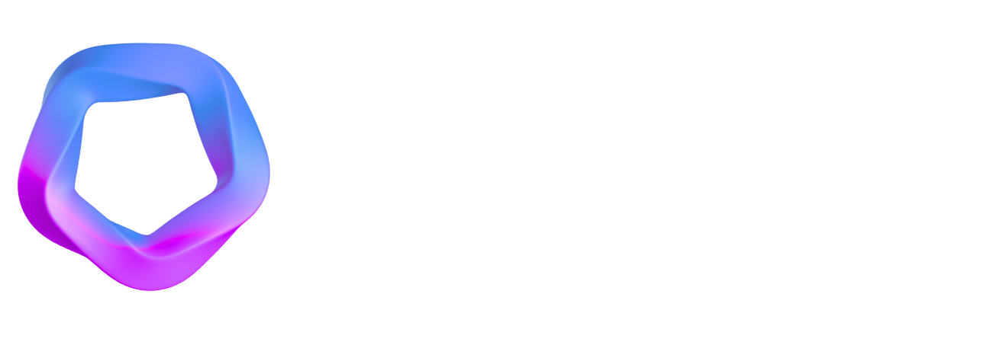

<div align="center">

# Velocis



**Enterprise-Grade Autonomous AI Engineering Platform**

*Transforming GitHub repositories into intelligent, self-healing systems with AI-powered code review, automated QA, and real-time architecture visualization*

[](https://app.velocis.dev)
[](#project-structure)
[](#prerequisites)
[](#technology-stack)
[](#license)

[Live Platform](https://app.velocis.dev) • [API Documentation](backend/API_CONTRACT.md) • [Architecture](#architecture) • [Roadmap](CORTEX_IMPROVEMENTS.md)

</div>

---

## 📖 Table of Contents

- [Overview](#overview)
- [Key Features](#key-features)
- [Architecture](#architecture)
- [Technology Stack](#technology-stack)
- [Getting Started](#getting-started)
  - [Prerequisites](#prerequisites)
  - [Installation](#installation)
  - [Configuration](#configuration)
  - [Running Locally](#running-locally)
- [Project Structure](#project-structure)
- [Core Modules](#core-modules)
- [API Reference](#api-reference)
- [Deployment](#deployment)
- [Testing](#testing)
- [Contributing](#contributing)
- [Security](#security)
- [License](#license)
- [Support](#support)

---

## Overview

**Velocis** is a production-grade autonomous AI engineering platform that revolutionizes software development by integrating deeply with GitHub repositories. It provides continuous code quality improvement, intelligent risk analysis, automated QA pipelines, and real-time architecture visualization—all powered by cutting-edge AI models including DeepSeek V3, Llama 3, and Claude.

Unlike traditional CI/CD tools that simply execute predefined scripts, Velocis acts as an autonomous senior engineer on your team, proactively identifying issues, writing tests, fixing bugs, and providing architectural insights without manual intervention.

### What Makes Velocis Unique

- **Autonomous Self-Healing**: AI writes tests, detects failures, analyzes root causes, generates fixes, and validates—all automatically
- **Multi-Model AI Architecture**: Leverages specialized AI models for different tasks (Llama 3 for test generation, Claude for analysis, DeepSeek for code review)
- **Real-Time Architecture Visualization**: Interactive 3D/2D service topology maps with live health metrics and dependency tracking
- **Multilingual AI Support**: Code review and mentoring in English, Hindi, and Tamil
- **Zero-Configuration Infrastructure**: Automatically generates Terraform code and cost forecasts from repository analysis
- **Production-Ready**: Built on AWS serverless architecture with DynamoDB, Lambda, API Gateway, and Bedrock

### Target Audience

- **Engineering Teams** seeking to accelerate development velocity while maintaining code quality
- **CTOs & Engineering Managers** responsible for technical debt, system reliability, and team productivity
- **DevOps & Platform Engineers** building scalable, observable infrastructure
- **Startups & Scale-ups** needing enterprise-grade tooling without enterprise overhead
- **Open Source Maintainers** managing complex codebases with limited resources

### Production Endpoints

- **Frontend Application**: https://app.velocis.dev
- **REST API**: https://api.velocis.dev/v1
- **API Documentation**: [API Contract](backend/API_CONTRACT.md)
- **System Status**: Real-time health monitoring via `/api/system/health`

---

## Key Features

### 🛡️ Sentinel Agent - AI-Powered Code Intelligence
Sentinel acts as your autonomous code reviewer, providing deep analysis and risk assessment for every pull request and commit.

**Core Capabilities:**
- **Automated PR Risk Scoring**: AI-powered risk analysis (0-100 scale) for every pull request with detailed severity classification
- **Security Vulnerability Detection**: Identifies race conditions, SQL injection risks, authentication flaws, and OWASP Top 10 vulnerabilities
- **Code Quality Analysis**: Detects code smells, anti-patterns, complexity hotspots, and maintainability issues
- **Multilingual AI Mentor**: Interactive code review assistant supporting English, Hindi, and Tamil with context-aware suggestions
- **Real-Time Annotations**: In-editor warnings, refactoring opportunities, and best practice recommendations
- **Historical Trend Analysis**: Track code quality metrics over time with actionable insights

**Technical Implementation:**
- Powered by DeepSeek V3 for deep semantic code understanding
- AWS Bedrock integration for scalable AI inference
- DynamoDB for fast annotation retrieval and caching
- GitHub API integration for seamless PR workflow

---

### 🏰 Fortress Agent - Autonomous QA Pipeline
Fortress implements a revolutionary self-healing test loop that autonomously writes tests, detects failures, and fixes code—without human intervention.

**Core Capabilities:**
- **Self-Healing Test Loops**: AI writes tests → Detects failures → Analyzes root cause → Generates fix → Validates → Repeats
- **Multi-Model AI Workflow**: 
  - Llama 3 generates comprehensive test cases based on code changes
  - Claude analyzes test failures and identifies root causes
  - DeepSeek generates code fixes with high accuracy
- **Intelligent Test Strategy**: AI-generated QA plans tailored to your codebase architecture
- **Flaky Test Detection**: Automatically identifies and quarantines unstable tests
- **Test Stability Tracking**: Real-time metrics on test reliability and coverage
- **API Documentation Generation**: Automatically generates and validates API contracts

**Technical Implementation:**
- AWS Step Functions for orchestrating the TDD loop
- Lambda functions for test execution and analysis
- DynamoDB for pipeline state management
- GitHub webhooks for automatic triggering on push/PR events

**Workflow Example:**
```
1. Developer pushes code to main branch
2. Fortress detects changes via webhook
3. Llama 3 generates test cases (4.2s)
4. Tests execute and fail (2.1s)
5. Claude analyzes failure patterns (3.8s)
6. DeepSeek generates code fix (2.5s)
7. Tests re-run and pass (1.8s)
8. Fix committed automatically or PR created
```

---

### 🧠 Cortex Agent - Visual Service Topology
Cortex provides real-time, interactive visualization of your microservice architecture with live health metrics and dependency tracking.

**Core Capabilities:**
- **Interactive Service Map**: 3D/2D visualization using ReactFlow with drag-and-drop interaction
- **Automatic Service Discovery**: Analyzes codebase to identify services, APIs, and dependencies
- **Real-Time Health Monitoring**: Per-service metrics including:
  - P95 latency tracking
  - Error rate percentages
  - Test stability scores
  - Deployment status
- **Dependency Analysis**: Visual representation of service interconnections with blast radius calculation
- **Critical Path Highlighting**: Identifies services in critical failure paths
- **Timeline Visualization**: Historical deployment and event tracking with anomaly detection
- **Layer-Based Organization**: Automatic categorization into Edge, Compute, and Data layers

**Technical Implementation:**
- ReactFlow for interactive graph rendering
- Dagre algorithm for automatic layout optimization
- Real-time polling for live updates (configurable interval)
- DynamoDB for service metadata and metrics storage
- GitHub repository analysis for service discovery

**Visualization Features:**
- Color-coded health status (Healthy/Warning/Critical)
- Sparkline graphs for metric trends
- Click-to-details sidebar with comprehensive service information
- Search and filter capabilities
- Export to PNG for documentation

---

### 💻 Workspace - AI-Powered Code Editor
Workspace provides a full-featured code editor with integrated AI assistance, directly in your browser.

**Core Capabilities:**
- **Monaco Editor Integration**: Full-featured code editor with syntax highlighting for 50+ languages
- **GitHub File Browser**: Navigate repository structure with branch switching and file search
- **Sentinel Annotations**: Inline AI-generated warnings, suggestions, and refactoring opportunities
- **Context-Aware AI Chat**: Conversational AI assistant with full codebase context
- **Multi-Branch Support**: Switch between branches without leaving the editor
- **Direct Commit & Push**: Make changes and commit directly to GitHub
- **Code Review Mode**: Trigger full codebase reviews with detailed analysis

**Technical Implementation:**
- Monaco Editor (VS Code's editor engine)
- GitHub API for file operations
- AWS Bedrock for AI chat responses
- DynamoDB for chat history and annotations
- Real-time annotation updates via polling

---

### 🏗️ Infrastructure Predictor - Automated IaC Generation
Infrastructure Predictor analyzes your codebase and automatically generates production-ready Terraform code with cost forecasts.

**Core Capabilities:**
- **Automated IaC Generation**: Generates Terraform code from repository analysis
- **Multi-Environment Support**: Separate configurations for production, staging, and preview environments
- **AWS Cost Forecasting**: Detailed monthly cost predictions with service-level breakdown
- **Service-Level Cost Analysis**: Per-service cost attribution (Lambda, API Gateway, DynamoDB, etc.)
- **Region Optimization**: Intelligent region selection based on usage patterns and latency requirements
- **Infrastructure Drift Detection**: Identifies discrepancies between code and deployed infrastructure

**Technical Implementation:**
- AI-powered code analysis to infer infrastructure requirements
- AWS Pricing API integration for accurate cost forecasting
- Terraform code generation with best practices
- DynamoDB for IaC state and job tracking

**Cost Breakdown Example:**
```
Monthly Cost: $18.42
- Lambda (46%): $8.50
- API Gateway (23%): $4.20
- DynamoDB (18%): $3.40
- Step Functions (10%): $1.82
- Misc (3%): $0.50
```

---

### 📊 Unified Dashboard - Cross-Repository Intelligence
Centralized command center providing aggregate insights across all installed repositories.

**Core Capabilities:**
- **Repository Health Overview**: At-a-glance status for all repositories (Healthy/Warning/Critical)
- **Real-Time Activity Feed**: Live stream of events from Sentinel, Fortress, and Cortex agents
- **System Metrics**: Platform-wide health indicators:
  - API latency (P95)
  - Queue depth
  - Agent uptime percentages
  - Storage utilization
- **Deployment Tracking**: Recent deployment history with status indicators
- **Risk Aggregation**: Total open risks across all repositories
- **Commit Trend Analysis**: Sparkline graphs showing commit velocity trends

**Technical Implementation:**
- Server-side aggregation for fast dashboard loading
- DynamoDB queries across multiple tables
- Real-time polling for live updates
- Responsive design for mobile and desktop

---

### ⚙️ Repository Automation - Configurable Workflows
Fine-grained control over automation behavior on a per-repository basis.

**Core Capabilities:**
- **Configurable Automation Settings**: Enable/disable specific agents per repository
- **Webhook Integration**: Automatic triggering on GitHub push and PR events
- **Manual Triggers**: On-demand automation execution for testing and debugging
- **Automation Reports**: Detailed reports on automated actions and outcomes
- **Custom Thresholds**: Configure risk score thresholds and alert rules
- **Notification Preferences**: Slack, email, or webhook notifications for critical events

**Technical Implementation:**
- DynamoDB for settings storage
- GitHub webhooks for event-driven automation
- Lambda functions for automation execution
- API endpoints for manual triggering

---

## Architecture

Velocis implements a modern, cloud-native serverless architecture designed for scalability, reliability, and cost-efficiency.

### High-Level Architecture Diagram

```
┌─────────────────────────────────────────────────────────────────────────────┐
│                            CLIENT LAYER                                     │
│  ┌──────────────────────────────────────────────────────────────────────┐  │
│  │  React 18 SPA (TypeScript + Vite)                                    │  │
│  │  • Monaco Editor • React Three Fiber • ReactFlow • Radix UI          │  │
│  │  • Framer Motion • GSAP • Recharts • Tailwind CSS                    │  │
│  └──────────────────────────────────────────────────────────────────────┘  │
└────────────────────────────────┬────────────────────────────────────────────┘
                                 │ HTTPS/REST (JWT Auth)
┌────────────────────────────────┴────────────────────────────────────────────┐
│                         API GATEWAY LAYER                                   │
│  ┌──────────────────────────────────────────────────────────────────────┐  │
│  │  AWS API Gateway (Production) / Express (Local Development)          │  │
│  │  • CORS Configuration • Rate Limiting • Request Validation           │  │
│  │  • JWT Authentication • GitHub OAuth Flow                            │  │
│  └──────────────────────────────────────────────────────────────────────┘  │
└────────────────────────────────┬────────────────────────────────────────────┘
                                 │
┌────────────────────────────────┴────────────────────────────────────────────┐
│                        APPLICATION LAYER (Lambda)                           │
│  ┌──────────────┐  ┌──────────────┐  ┌──────────────┐  ┌──────────────┐  │
│  │   Sentinel   │  │   Fortress   │  │    Cortex    │  │  Workspace   │  │
│  │  Agent       │  │   Agent      │  │   Agent      │  │   Module     │  │
│  │              │  │              │  │              │  │              │  │
│  │ • PR Review  │  │ • Test Gen   │  │ • Service    │  │ • File Ops   │  │
│  │ • Risk Score │  │ • Failure    │  │   Discovery  │  │ • AI Chat    │  │
│  │ • Security   │  │   Analysis   │  │ • Dependency │  │ • Annotations│  │
│  │   Scan       │  │ • Auto Fix   │  │   Graph      │  │ • Code Edit  │  │
│  │ • Mentor AI  │  │ • QA Plan    │  │ • Health     │  │              │  │
│  └──────────────┘  └──────────────┘  └──────────────┘  └──────────────┘  │
│                                                                              │
│  ┌──────────────┐  ┌──────────────┐  ┌──────────────┐  ┌──────────────┐  │
│  │Infrastructure│  │   Activity   │  │  Dashboard   │  │   Webhooks   │  │
│  │  Predictor   │  │    Feed      │  │   Module     │  │   Handler    │  │
│  │              │  │              │  │              │  │              │  │
│  │ • IaC Gen    │  │ • Event Log  │  │ • Repo       │  │ • GitHub     │  │
│  │ • Cost       │  │ • Filtering  │  │   Aggregation│  │   Push       │  │
│  │   Forecast   │  │ • Real-time  │  │ • Metrics    │  │ • PR Events  │  │
│  │ • Terraform  │  │   Updates    │  │ • System     │  │ • Deployment │  │
│  └──────────────┘  └──────────────┘  └──────────────┘  └──────────────┘  │
└────────────────────────────────┬────────────────────────────────────────────┘
                                 │
┌────────────────────────────────┴────────────────────────────────────────────┐
│                       INTEGRATION LAYER                                     │
│  ┌──────────────┐  ┌──────────────┐  ┌──────────────┐  ┌──────────────┐  │
│  │   GitHub     │  │  AWS Bedrock │  │  AWS         │  │  AWS Step    │  │
│  │   API        │  │              │  │  Translate   │  │  Functions   │  │
│  │              │  │              │  │              │  │              │  │
│  │ • OAuth      │  │ • DeepSeek V3│  │ • Multi-lang │  │ • TDD Loop   │  │
│  │ • Repos      │  │ • Llama 3    │  │   Support    │  │ • Workflow   │  │
│  │ • Files      │  │ • Claude     │  │ • EN/HI/TA   │  │   Orchestr.  │  │
│  │ • Webhooks   │  │ • Streaming  │  │              │  │              │  │
│  └──────────────┘  └──────────────┘  └──────────────┘  └──────────────┘  │
└────────────────────────────────┬────────────────────────────────────────────┘
                                 │
┌────────────────────────────────┴────────────────────────────────────────────┐
│                          DATA LAYER                                         │
│  ┌──────────────────────────────────────────────────────────────────────┐  │
│  │                    Amazon DynamoDB (14 Tables)                        │  │
│  │                                                                        │  │
│  │  • velocis-users              • velocis-repos                         │  │
│  │  • velocis-sentinel           • velocis-pipeline-runs                 │  │
│  │  • velocis-cortex             • velocis-timeline                      │  │
│  │  • velocis-activity           • velocis-deployments                   │  │
│  │  • velocis-annotations        • velocis-workspace-chat                │  │
│  │  • velocis-iac                • velocis-iac-jobs                      │  │
│  │  • velocis-system-health      • velocis-installations                 │  │
│  │                                                                        │  │
│  │  Billing Mode: PAY_PER_REQUEST (Auto-scaling)                         │  │
│  └──────────────────────────────────────────────────────────────────────┘  │
└─────────────────────────────────────────────────────────────────────────────┘
```

### Architectural Principles

1. **Serverless-First Design**
   - AWS Lambda for compute (Node.js 20.x on ARM64)
   - Pay-per-request pricing model
   - Automatic scaling from 0 to thousands of concurrent executions
   - No server management or patching required

2. **Event-Driven Architecture**
   - GitHub webhooks trigger automated workflows
   - Asynchronous processing for long-running tasks
   - Event sourcing for audit trails and debugging

3. **Multi-Model AI Strategy**
   - DeepSeek V3 for deep code analysis and security scanning
   - Llama 3 for test generation and QA planning
   - Claude for failure analysis and root cause identification
   - Model selection based on task requirements and cost optimization

4. **Separation of Concerns**
   - Clear boundaries between agents (Sentinel, Fortress, Cortex)
   - Modular Lambda functions for maintainability
   - Shared utilities and services layer

5. **Local Development Parity**
   - Express adapter wraps Lambda handlers for local development
   - Same code runs locally and in production
   - Fast iteration without cloud deployment

6. **Data Isolation**
   - One DynamoDB table per domain (users, repos, sentinel, etc.)
   - Future migration path to single-table design if needed
   - Efficient query patterns with partition keys

### Deployment Architecture

**Production Environment:**
- AWS SAM for infrastructure as code
- CloudFormation for stack management
- API Gateway with custom domain (api.velocis.dev)
- CloudFront for frontend distribution (app.velocis.dev)
- Route 53 for DNS management
- AWS Secrets Manager for sensitive configuration

**Development Environment:**
- Local Express server on port 3001
- DynamoDB Local via Docker
- Vite dev server on port 5173
- Hot module replacement for rapid iteration

### Security Architecture

- **Authentication**: GitHub OAuth 2.0 with JWT tokens
- **Authorization**: User-scoped access to repositories
- **Secrets Management**: AWS Systems Manager Parameter Store
- **API Security**: CORS, rate limiting, request validation
- **Data Encryption**: At-rest (DynamoDB) and in-transit (TLS 1.3)
- **Webhook Verification**: HMAC signature validation for GitHub webhooks

### Scalability Considerations

- **Horizontal Scaling**: Lambda auto-scales based on request volume
- **Database Scaling**: DynamoDB PAY_PER_REQUEST mode handles traffic spikes
- **Caching Strategy**: In-memory caching for frequently accessed data
- **Rate Limiting**: Per-user and per-repository rate limits
- **Cost Optimization**: ARM64 Lambda functions for 20% cost reduction

---

## Technology Stack

### Frontend
| Technology | Version | Purpose |
|------------|---------|---------|
| React | 18.3.1 | UI framework |
| TypeScript | 5.9.3 | Type safety |
| Vite | 6.4.1 | Build tool & dev server |
| React Router | 7.13.0 | Client-side routing |
| Tailwind CSS | 4.1.12 | Utility-first styling |
| Radix UI | Latest | Accessible component primitives |
| Framer Motion | 12.34.3 | Animation library |
| GSAP | 3.14.2 | Advanced animations |
| Monaco Editor | 4.7.0 | Code editor |
| React Three Fiber | 8.18.0 | 3D graphics |
| ReactFlow | 11.11.4 | Interactive diagrams |
| Recharts | 2.15.2 | Data visualization |

### Backend
| Technology | Version | Purpose |
|------------|---------|---------|
| Node.js | 20.x | Runtime environment |
| TypeScript | 5.9.3 | Type safety |
| Express | 5.2.1 | Local dev server |
| AWS SDK v3 | Latest | AWS service integration |
| Pino | 10.3.1 | Structured logging |
| Zod | 4.3.6 | Schema validation |
| Octokit | 22.0.1 | GitHub API client |
| jsonwebtoken | 9.0.2 | JWT authentication |

### Infrastructure
| Service | Purpose |
|---------|---------|
| AWS Lambda | Serverless compute |
| AWS API Gateway | REST API management |
| Amazon DynamoDB | NoSQL database |
| Amazon Bedrock | AI model hosting |
| Amazon Translate | Multilingual support |
| AWS SAM | Infrastructure as Code |
| AWS CDK | Advanced IaC (experimental) |
| GitHub OAuth | Authentication |
| GitHub API | Repository integration |

---

## Getting Started

### Prerequisites

Ensure you have the following installed and configured:

- **Node.js** 20.x or higher ([Download](https://nodejs.org/))
- **npm** 10.x or higher (comes with Node.js)
- **Docker** (for local DynamoDB) ([Download](https://www.docker.com/))
- **AWS Account** with appropriate permissions
- **GitHub OAuth App** credentials ([Create App](https://github.com/settings/developers))
- **Git** for version control

### Installation

1. **Clone the repository**
   ```bash
   git clone https://github.com/your-org/velocis.git
   cd velocis
   ```

2. **Install backend dependencies**
   ```bash
   cd backend
   npm install
   cd ..
   ```

3. **Install frontend dependencies**
   ```bash
   cd frontend
   npm install
   cd ..
   ```

4. **Install CDK infrastructure dependencies** (optional)
   ```bash
   cd velocis-cdk-infra
   npm install
   cd ..
   ```

### Configuration

#### 1. Backend Environment Variables

Create environment files from examples:

**Bash/Linux/macOS:**
```bash
cp backend/.env.example backend/.env.development
```

**Windows PowerShell:**
```powershell
Copy-Item backend\.env.example backend\.env.development
```

Edit `backend/.env.development` and configure:

```env
# GitHub OAuth (Required)
GITHUB_CLIENT_ID=your_github_client_id
GITHUB_CLIENT_SECRET=your_github_client_secret
GITHUB_OAUTH_REDIRECT_URI=http://localhost:3001/api/auth/github/callback
GITHUB_WEBHOOK_SECRET=your_webhook_secret

# Security (Required)
JWT_SECRET=your_jwt_secret_min_32_chars
TOKEN_ENCRYPTION_KEY=your_64_char_hex_encryption_key

# AWS Configuration (Required)
AWS_REGION=us-east-1
AWS_ACCESS_KEY_ID=your_aws_access_key
AWS_SECRET_ACCESS_KEY=your_aws_secret_key

# Application URLs
FRONTEND_URL=http://localhost:5173
ALLOWED_ORIGINS=http://localhost:5173
API_BASE_URL=http://localhost:3001

# DynamoDB Tables (Auto-configured for local)
USERS_TABLE=velocis-users
REPOS_TABLE=velocis-repos
SENTINEL_TABLE=velocis-sentinel
PIPELINE_TABLE=velocis-pipeline-runs
CORTEX_TABLE=velocis-cortex
# ... (see .env.example for complete list)
```

#### 2. Frontend Environment Variables

Create frontend environment file:

**Bash/Linux/macOS:**
```bash
cp frontend/.env.example frontend/.env
```

**Windows PowerShell:**
```powershell
Copy-Item frontend\.env.example frontend\.env
```

Edit `frontend/.env`:

```env
VITE_BACKEND_URL=http://localhost:3001
```

#### 3. Initialize Local DynamoDB

Start DynamoDB Local using Docker:

```bash
docker run -d \
  --name velocis-dynamodb \
  -p 8000:8000 \
  amazon/dynamodb-local
```

**Windows PowerShell:**
```powershell
docker run -d `
  --name velocis-dynamodb `
  -p 8000:8000 `
  amazon/dynamodb-local
```

Initialize database tables:

```bash
cd backend
npm run init:tables
```

### Running Locally

#### Start Backend Server

Open a terminal and run:

```bash
cd backend
npm run dev
```

Backend will start at: **http://localhost:3001**

#### Start Frontend Development Server

Open a second terminal and run:

```bash
cd frontend
npm run dev
```

Frontend will start at: **http://localhost:5173**

#### Verify Installation

1. Navigate to http://localhost:5173
2. Click "Sign in with GitHub"
3. Complete OAuth flow
4. You should see the onboarding page

---

## Project Structure

```
velocis/
├── frontend/                      # React frontend application
│   ├── src/
│   │   ├── app/
│   │   │   ├── pages/            # Page components
│   │   │   │   ├── HomePage.tsx
│   │   │   │   ├── DashboardPage.tsx
│   │   │   │   ├── RepositoryPage.tsx
│   │   │   │   ├── CortexPage.tsx
│   │   │   │   ├── WorkspacePage.tsx
│   │   │   │   ├── PipelinePage.tsx
│   │   │   │   ├── InfrastructurePage.tsx
│   │   │   │   └── ...
│   │   │   ├── components/       # Reusable UI components
│   │   │   │   ├── shared/       # Shared components
│   │   │   │   ├── ui/           # Radix UI wrappers
│   │   │   │   └── ...
│   │   │   ├── services/         # API client
│   │   │   └── routes.tsx        # Route configuration
│   │   ├── lib/                  # Utilities
│   │   │   ├── api.ts           # API client
│   │   │   ├── auth.tsx         # Auth context
│   │   │   ├── theme.tsx        # Theme provider
│   │   │   └── utils.ts         # Helper functions
│   │   ├── styles/              # Global styles
│   │   └── main.tsx             # Application entry
│   ├── package.json
│   ├── vite.config.ts
│   └── tsconfig.json
│
├── backend/                       # Node.js backend
│   ├── src/
│   │   ├── handlers/
│   │   │   ├── api/              # API route handlers
│   │   │   │   ├── auth.ts
│   │   │   │   ├── getDashboard.ts
│   │   │   │   ├── getSentinelData.ts
│   │   │   │   ├── getPipelineData.ts
│   │   │   │   ├── getCortexServices.ts
│   │   │   │   ├── getWorkspaceData.ts
│   │   │   │   ├── getInfrastructureData.ts
│   │   │   │   └── ...
│   │   │   └── webhooks/         # GitHub webhook handlers
│   │   │       └── githubPush.ts
│   │   ├── functions/            # Core agent logic
│   │   │   ├── sentinel/         # Code review AI
│   │   │   ├── fortress/         # QA automation
│   │   │   ├── cortex/           # Service mapping
│   │   │   └── predictor/        # IaC generation
│   │   ├── services/             # External integrations
│   │   │   ├── aws/              # AWS SDK clients
│   │   │   ├── github/           # GitHub API
│   │   │   └── database/         # DynamoDB client
│   │   ├── models/               # TypeScript interfaces
│   │   │   ├── interfaces/
│   │   │   └── schemas/
│   │   ├── middlewares/          # Express middlewares
│   │   ├── utils/                # Utilities
│   │   │   ├── config.ts        # Environment config
│   │   │   ├── logger.ts        # Pino logger
│   │   │   └── ...
│   │   └── prompts/              # AI prompt templates
│   ├── tests/                    # Test suites
│   ├── server.ts                 # Local Express server
│   ├── template.yaml             # AWS SAM template
│   ├── API_CONTRACT.md           # API documentation
│   ├── package.json
│   └── tsconfig.json
│
├── velocis-cdk-infra/            # AWS CDK infrastructure
│   ├── lib/
│   │   └── velocis-cdk-infra-stack.ts
│   ├── bin/
│   ├── lambda/                   # Lambda function code
│   ├── test/
│   ├── cdk.json
│   ├── package.json
│   └── tsconfig.json
│
├── scripts/                       # Utility scripts
│   ├── fetch_aws.js              # AWS icon fetcher
│   ├── fetch_icons.js            # Icon utilities
│   └── ...
│
├── CORTEX_IMPROVEMENTS.md        # Product roadmap
├── README.md                     # This file
└── LICENSE                       # Proprietary license
```

---

## Core Modules

### Sentinel Agent (`backend/src/functions/sentinel/`)
Intelligent code review and risk analysis powered by AI.

**Key Capabilities:**
- PR risk scoring (0-100 scale)
- Security vulnerability detection
- Code quality analysis
- Multilingual mentor chat (EN/HI/TA)
- Real-time code annotations

**API Endpoints:**
- `GET /repos/:repoId/sentinel/prs` - List PRs with risk scores
- `GET /repos/:repoId/sentinel/prs/:prNumber` - Detailed PR analysis
- `POST /repos/:repoId/sentinel/scan` - Trigger manual scan
- `GET /repos/:repoId/sentinel/activity` - Recent Sentinel events

### Fortress Agent (`backend/src/functions/fortress/`)
Autonomous QA pipeline with self-healing test loops.

**Key Capabilities:**
- AI-generated test cases (Llama 3)
- Failure analysis (Claude)
- Automated code fixes
- Test stability tracking
- QA strategy generation

**API Endpoints:**
- `GET /repos/:repoId/pipeline` - Current pipeline state
- `GET /repos/:repoId/pipeline/runs` - Historical runs
- `POST /repos/:repoId/pipeline/trigger` - Manual trigger
- `GET /repos/:repoId/pipeline/runs/:runId` - Run details

### Cortex Agent (`backend/src/functions/cortex/`)
Visual service topology and dependency analysis.

**Key Capabilities:**
- Microservice discovery
- Dependency graph generation
- Health monitoring per service
- Blast radius calculation
- Timeline visualization

**API Endpoints:**
- `GET /repos/:repoId/cortex/services` - Service map data
- `GET /repos/:repoId/cortex/services/:serviceId` - Service details
- `GET /repos/:repoId/cortex/timeline` - Deployment timeline
- `POST /repos/:repoId/cortex/rebuild` - Rebuild service map

### Workspace Module (`backend/src/handlers/api/getWorkspaceData.ts`)
AI-powered code editor with GitHub integration.

**Key Capabilities:**
- Monaco editor integration
- GitHub file browser
- Branch switching
- Sentinel annotations
- Context-aware AI chat

**API Endpoints:**
- `GET /repos/:repoId/workspace/files` - List repository files
- `GET /repos/:repoId/workspace/files/content` - File content
- `GET /repos/:repoId/workspace/annotations` - Code annotations
- `POST /repos/:repoId/workspace/chat` - AI chat
- `POST /repos/:repoId/workspace/push` - Commit changes

### Infrastructure Predictor (`backend/src/functions/predictor/`)
Automated IaC generation and cost forecasting.

**Key Capabilities:**
- Terraform code generation
- Multi-environment support
- AWS cost prediction
- Service-level cost breakdown
- Region optimization

**API Endpoints:**
- `GET /repos/:repoId/infrastructure` - Infrastructure overview
- `GET /repos/:repoId/infrastructure/terraform` - Generated Terraform
- `POST /repos/:repoId/infrastructure/generate` - Trigger generation
- `GET /repos/:repoId/infrastructure/forecast` - Cost forecast

---

## API Reference

Complete API documentation is available in [backend/API_CONTRACT.md](backend/API_CONTRACT.md).

### Base URL
- **Production**: `https://api.velocis.dev/v1`
- **Local Development**: `http://localhost:3001/api`

### Authentication
All protected endpoints require JWT authentication:

```http
Authorization: Bearer <access_token>
```

Obtain access token via GitHub OAuth flow:
1. `GET /auth/github` - Redirect to GitHub
2. `GET /auth/github/callback` - Exchange code for token

### Quick Reference

| Category | Endpoint | Method | Description |
|----------|----------|--------|-------------|
| **Auth** | `/auth/github` | GET | Initiate OAuth |
| | `/auth/github/callback` | GET | OAuth callback |
| | `/auth/logout` | POST | Logout |
| **User** | `/me` | GET | Current user |
| **Repos** | `/github/repos` | GET | List GitHub repos |
| | `/repos/:id/install` | POST | Install Velocis |
| **Dashboard** | `/dashboard` | GET | Dashboard data |
| **Sentinel** | `/repos/:id/sentinel/prs` | GET | List PRs |
| **Fortress** | `/repos/:id/pipeline` | GET | Pipeline state |
| **Cortex** | `/repos/:id/cortex/services` | GET | Service map |
| **Workspace** | `/repos/:id/workspace/files` | GET | File browser |
| **Infrastructure** | `/repos/:id/infrastructure` | GET | IaC data |

---

## Deployment

### AWS SAM Deployment

1. **Build the application**
   ```bash
   cd backend
   npm run build
   ```

2. **Package SAM template**
   ```bash
   sam package \
     --template-file template.yaml \
     --output-template-file packaged.yaml \
     --s3-bucket your-deployment-bucket
   ```

3. **Deploy to AWS**
   ```bash
   sam deploy \
     --template-file packaged.yaml \
     --stack-name velocis-backend \
     --capabilities CAPABILITY_IAM \
     --parameter-overrides Environment=production
   ```

### AWS CDK Deployment (Experimental)

```bash
cd velocis-cdk-infra
npm run build
cdk deploy
```

### Frontend Deployment

Build production bundle:

```bash
cd frontend
npm run build
```

Deploy `dist/` directory to:
- **AWS S3 + CloudFront**
- **Vercel**
- **Netlify**
- **Any static hosting service**

---

## Testing

### Backend Tests

```bash
cd backend
npm run build  # Verify TypeScript compilation
```

**Note**: Full test suite is under development. Current test files:
- `backend/tests/fortress.test.ts`
- `backend/tests/sentinel.test.ts`

### Frontend Tests

```bash
cd frontend
npm run build  # Verify production build
```

**Note**: Frontend test framework is not yet configured.

### CDK Infrastructure Tests

```bash
cd velocis-cdk-infra
npm test
```

---

## Contributing

We welcome contributions from the team! Please follow these guidelines:

### Branch Naming Convention

- `feature/<short-description>` - New features
- `fix/<short-description>` - Bug fixes
- `docs/<short-description>` - Documentation updates
- `refactor/<short-description>` - Code refactoring
- `test/<short-description>` - Test additions/updates

### Commit Message Format

Follow [Conventional Commits](https://www.conventionalcommits.org/):

```
<type>(<scope>): <subject>

<body>

<footer>
```

**Examples:**
```
feat(sentinel): add multilingual support for Tamil
fix(cortex): resolve service map rendering issue
docs(api): update authentication flow documentation
refactor(workspace): extract Monaco editor config
test(fortress): add unit tests for QA loop
```

### Pull Request Process

1. **Create a feature branch** from `main`
2. **Make your changes** with clear, focused commits
3. **Build and test** your changes locally
4. **Update documentation** if needed
5. **Open a PR** with:
   - Clear title and description
   - Risk level assessment (Low/Medium/High)
   - Test evidence (screenshots, logs, test results)
6. **Request review** from at least one team member
7. **Address feedback** and update PR
8. **Merge** once approved (squash and merge preferred)

### Code Style

- **TypeScript**: Follow existing patterns, use strict mode
- **React**: Functional components with hooks
- **Naming**: camelCase for variables/functions, PascalCase for components
- **Formatting**: Prettier (auto-format on save recommended)
- **Linting**: ESLint rules (to be configured)

---

## Security

### Reporting Security Issues

**DO NOT** open public issues for security vulnerabilities.

Instead, email: **security@velocis.dev** (or your internal security contact)

Include:
- Description of the vulnerability
- Steps to reproduce
- Potential impact
- Suggested fix (if any)

### Security Best Practices

- **Never commit secrets** (use `.env` files, add to `.gitignore`)
- **Rotate credentials** regularly
- **Use IAM roles** instead of access keys when possible
- **Enable MFA** on AWS accounts
- **Review dependencies** for known vulnerabilities
- **Follow principle of least privilege**

### Dependency Security

Run security audits regularly:

```bash
# Backend
cd backend
npm audit

# Frontend
cd frontend
npm audit

# Fix vulnerabilities
npm audit fix
```

---

## License

**Copyright © 2024-2026 Velocis Technologies. All Rights Reserved.**

This software and associated documentation files (the "Software") are proprietary and confidential. Unauthorized copying, modification, distribution, or use of this Software, via any medium, is strictly prohibited without explicit written permission from Velocis Technologies.

### Terms and Conditions

1. **Ownership and Intellectual Property**
   - All rights, title, and interest in and to the Software, including all intellectual property rights, remain exclusively with Velocis Technologies.
   - This includes, but is not limited to, source code, object code, documentation, algorithms, trade secrets, and know-how.

2. **Restrictions**
   
   You may NOT:
   - Copy, reproduce, or duplicate the Software or any portion thereof
   - Modify, adapt, translate, or create derivative works based on the Software
   - Reverse engineer, decompile, disassemble, or attempt to derive the source code
   - Distribute, sublicense, lease, rent, loan, or transfer the Software to any third party
   - Remove, alter, or obscure any proprietary notices, labels, or marks
   - Use the Software for commercial purposes without explicit written authorization
   - Benchmark or perform competitive analysis without prior written consent
   - Extract or reuse any components, algorithms, or methodologies

3. **Authorized Use**
   - This Software is intended for internal use by authorized personnel of Velocis Technologies only.
   - Access is granted on a need-to-know basis and may be revoked at any time.
   - All use must comply with applicable laws, regulations, and company policies.

4. **Confidentiality**
   - The Software contains trade secrets and confidential information.
   - Recipients must maintain strict confidentiality and implement reasonable security measures.
   - Disclosure to third parties is prohibited without explicit written authorization.

5. **No Warranty**
   
   THE SOFTWARE IS PROVIDED "AS IS" WITHOUT WARRANTY OF ANY KIND, EXPRESS OR IMPLIED, INCLUDING BUT NOT LIMITED TO:
   - Warranties of merchantability
   - Fitness for a particular purpose
   - Non-infringement
   - Accuracy, reliability, or completeness
   
   Velocis Technologies does not warrant that the Software will be error-free, uninterrupted, or meet your requirements.

6. **Limitation of Liability**
   
   IN NO EVENT SHALL VELOCIS TECHNOLOGIES BE LIABLE FOR ANY:
   - Direct, indirect, incidental, special, exemplary, or consequential damages
   - Loss of profits, revenue, data, or business opportunities
   - Cost of procurement of substitute goods or services
   - Business interruption or system failures
   
   This limitation applies even if Velocis Technologies has been advised of the possibility of such damages.

7. **Indemnification**
   - You agree to indemnify and hold harmless Velocis Technologies from any claims, damages, or expenses arising from your unauthorized use or distribution of the Software.

8. **Termination**
   - This license is effective until terminated.
   - Velocis Technologies may terminate this license at any time without notice.
   - Upon termination, you must immediately cease all use and destroy all copies of the Software.

9. **Governing Law**
   - This license shall be governed by and construed in accordance with the laws of [Your Jurisdiction].
   - Any disputes shall be resolved exclusively in the courts of [Your Jurisdiction].

10. **Export Control**
    - The Software may be subject to export control laws and regulations.
    - You agree to comply with all applicable export and import laws.

11. **Audit Rights**
    - Velocis Technologies reserves the right to audit your use of the Software to ensure compliance with this license.

12. **Entire Agreement**
    - This license constitutes the entire agreement between you and Velocis Technologies regarding the Software.
    - Any modifications must be in writing and signed by both parties.

### Contact Information

For licensing inquiries, permissions, or questions:

- **Email**: legal@velocis.dev
- **Website**: https://velocis.dev
- **Address**: [Your Company Address]

### Third-Party Components

This Software may include third-party open-source components. See [ATTRIBUTIONS.md](frontend/ATTRIBUTIONS.md) for details on third-party licenses and attributions.

---

**NOTICE**: This is a legally binding agreement. By accessing or using this Software, you acknowledge that you have read, understood, and agree to be bound by these terms. If you do not agree, you must immediately cease all use and delete all copies of the Software.

---

## Support

### Documentation Resources

- **API Contract**: [backend/API_CONTRACT.md](backend/API_CONTRACT.md) - Complete REST API documentation with request/response examples
- **Architecture Guide**: See [Architecture](#architecture) section above
- **Product Roadmap**: [CORTEX_IMPROVEMENTS.md](CORTEX_IMPROVEMENTS.md) - Planned features and enhancements
- **Frontend Guidelines**: [frontend/guidelines/Guidelines.md](frontend/guidelines/Guidelines.md) - UI/UX design system
- **AWS SAM Template**: [backend/template.yaml](backend/template.yaml) - Infrastructure as code definition

### Getting Help

**Internal Team Support:**
- **Slack Channel**: `#velocis-engineering` - Technical discussions and troubleshooting
- **Product Channel**: `#velocis-product` - Feature requests and product feedback
- **Incidents**: `#velocis-incidents` - Production issues and urgent matters

**Issue Tracking:**
- **Bug Reports**: Open an issue in this repository with the `bug` label
- **Feature Requests**: Open an issue with the `enhancement` label
- **Security Issues**: Email security@velocis.dev (DO NOT open public issues)

**Email Support:**
- **Engineering**: rkj242004@gmail.com
- **Legal/Licensing**: rkj242004@gmail.com
- **General Inquiries**: rkj242004@gmail.com

### Useful External Links

- [GitHub OAuth Apps Documentation](https://docs.github.com/en/developers/apps/building-oauth-apps)
- [AWS SAM Developer Guide](https://docs.aws.amazon.com/serverless-application-model/)
- [Amazon Bedrock Documentation](https://aws.amazon.com/bedrock/)
- [DynamoDB Local Setup](https://docs.aws.amazon.com/amazondynamodb/latest/developerguide/DynamoDBLocal.html)
- [React Three Fiber Documentation](https://docs.pmnd.rs/react-three-fiber/)
- [ReactFlow Documentation](https://reactflow.dev/)
- [Monaco Editor API](https://microsoft.github.io/monaco-editor/)

### Troubleshooting Common Issues

**Backend won't start:**
```bash
# Check if port 3001 is already in use
netstat -ano | findstr :3001  # Windows
lsof -i :3001                 # macOS/Linux

# Kill the process and restart
npm run dev
```

**Frontend can't connect to backend:**
- Verify `VITE_BACKEND_URL` in `frontend/.env` is set to `http://localhost:3001`
- Check CORS configuration in `backend/server.ts`
- Ensure backend is running before starting frontend

**DynamoDB connection errors:**
```bash
# Verify DynamoDB Local is running
docker ps | grep dynamodb

# Restart DynamoDB Local
docker restart velocis-dynamodb

# Reinitialize tables
cd backend
npm run init:tables
```

**GitHub OAuth not working:**
- Verify `GITHUB_CLIENT_ID` and `GITHUB_CLIENT_SECRET` in `.env.development`
- Check OAuth callback URL matches: `http://localhost:3001/api/auth/github/callback`
- Ensure GitHub OAuth app is configured correctly in GitHub settings

**Build errors:**
```bash
# Clear node_modules and reinstall
rm -rf node_modules package-lock.json
npm install

# Clear TypeScript cache
rm -rf dist/
npm run build
```

### Performance Optimization Tips

**Frontend:**
- Enable React DevTools Profiler to identify slow components
- Use `React.memo()` for expensive components
- Implement virtual scrolling for large lists
- Lazy load routes with `React.lazy()`

**Backend:**
- Monitor Lambda cold starts in CloudWatch
- Increase Lambda memory for CPU-intensive operations
- Use DynamoDB batch operations for bulk reads/writes
- Implement caching for frequently accessed data

**Database:**
- Design partition keys to avoid hot partitions
- Use sparse indexes for optional attributes
- Enable DynamoDB auto-scaling for production
- Monitor read/write capacity metrics

---

<div align="center">

**Built with ❤️ by the Velocis Engineering Team**

[Website](https://velocis.dev) • [Documentation](backend/API_CONTRACT.md) • [Roadmap](CORTEX_IMPROVEMENTS.md) • [License](LICENSE)

---

*Velocis - Autonomous AI Engineering for Modern Development Teams*

</div>
